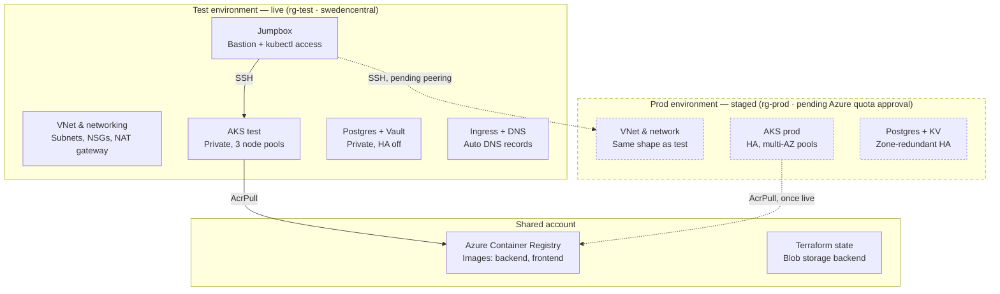

# Server Sorcery 101 — Cloud Migration to Azure 🧙‍♂️☁️

## Project Overview

This phase migrates the existing Go backend + React frontend + PostgreSQL
application (previously containerized and orchestrated on a self-hosted
Minikube cluster in earlier phases) to a production-grade Azure deployment.

The stack is built with:

- **Terraform** — all infrastructure as code, remote state in Azure Blob Storage
- **AKS** (Azure Kubernetes Service) — private clusters, no public IPs on
  control plane or nodes
- **ArgoCD** — GitOps, app-of-apps pattern, watching this repo
- **GitLab CI/CD** — test → build/push → auto-deploy test → manual gate →
  deploy prod
- **External Secrets Operator** + **Azure Key Vault** — no secrets committed
  to Git
- **External DNS** — automatic DNS record creation from Ingress/Service
  annotations
- **Prometheus + Grafana + Loki** — full monitoring and logging stack

Two environments are deployed from the same Terraform and Helm chart shape —
`test` and `prod` — differing only in input variables (HA on/off, node
counts, zone spread), per the assignment's explicit "don't overengineer,
keep the architecture identical" instruction.

### Why Azure

Azure was chosen deliberately over AWS/GCP (an earlier cost-analysis phase,
*Cloud Cartographer*, had actually recommended GCP on pure cost grounds)
because of Azure's dominance in Nordic enterprise environments — the target
job market this portfolio is built for. This is a case where job-market
relevance was weighted above pure cost optimization, and that tradeoff is
one I can walk through directly in review.

---

## Architecture



**Note on networking:** Azure Private DNS Zones are linked one-per-VNet-name.
Because the jumpbox is shared and sits on a single VNet, there is
intentionally **no path from prod's private zone back into test** — this is
an accepted, documented limitation rather than an oversight (see Engineering
Notes below).

### GitOps flow

```
GitLab repo (this repo)
    │  git push
    ▼
GitLab CI — test, build, push image + Helm chart to ACR
    │
    ▼
ArgoCD (app-of-apps) — watches this repo, syncs to AKS
    │
    ├── test namespace apps: auto-sync + self-heal
    └── prod namespace apps: manual sync only, triggered from the
        pipeline's post-approval stage
```

### Monitoring flow

```
Sample app + AKS nodes
    │  scrape
    ▼
Prometheus (kube-prometheus-stack) ── PrometheusRule alerts ──▶ Alertmanager ──▶ Slack
    │
    ▼
Grafana ◀── Loki (via Promtail) ── pod logs
```

---

## Repository Structure

```
├── argocd/
│   ├── test/applications/       # App-of-apps chart, test values
│   └── prod/applications/       # App-of-apps chart, prod values (manual sync)
├── sample-app/
│   ├── backend/                 # Go metrics API + Helm chart
│   └── frontend/                # React dashboard + Helm chart
├── terraform/
│   ├── shared/                  # ACR, Terraform state backend
│   ├── test/                    # VNet, AKS, Postgres, Key Vault (test)
│   └── prod/                    # Same shape, prod-specific variables
└── .gitlab-ci.yml
```

---

## Setup & Installation

### Prerequisites

- Azure subscription (Pay-As-You-Go — quota increases are not available on
  Free Trial subscriptions)
- Terraform, Azure CLI, `kubectl`, `helm` installed on a control box
- A GitLab account/project with CI/CD enabled

### 1. Bootstrap Terraform auth and remote state

```bash
az login
az account set --subscription <SUBSCRIPTION_ID>

# Create the service principal Terraform will authenticate as
az ad sp create-for-rbac --name terraform-sp \
  --role "Contributor" \
  --scopes /subscriptions/<SUBSCRIPTION_ID>

cd terraform/shared
terraform init
terraform apply
```

This provisions the remote state storage account/container and the shared
Azure Container Registry.

### 2. Provision the test environment

```bash
cd terraform/test
terraform init
terraform plan
terraform apply
```

This creates the VNet, subnets, NSGs, NAT gateway, the private `aks-test`
cluster (3 node pools: `main`, `tools` on Spot, `monitoring`), the jumpbox,
and Postgres Flexible Server with Key Vault-backed credentials.

### 3. Access the private cluster via the jumpbox

```bash
ssh -f -N -L 16443:<AKS_PRIVATE_FQDN>:443 -i /path/to/jumpbox_rsa azureuser@<JUMPBOX_IP>
az aks get-credentials --resource-group rg-test --name aks-test
kubectl get nodes
```

### 4. Install ArgoCD (the one Helm chart Terraform is allowed to install)

```bash
helm repo add argo https://argoproj.github.io/argo-helm
helm install argocd argo/argo-cd -n argocd --create-namespace
```

### 5. Apply the app-of-apps root Application

```bash
kubectl apply -f argocd/test/applications/root-app.yaml
```

From here, ArgoCD takes over: External Secrets, External DNS, the
monitoring stack, and the Sample app itself all install via ArgoCD syncing
this repo — no further manual `kubectl apply` in the deployment path.

### 6. Repeat for prod (same shape, different variables)

```bash
cd terraform/prod
terraform plan   # review: HA control plane, multi-AZ node pools, HA Postgres
terraform apply
kubectl apply -f argocd/prod/applications/root-app.yaml
# Prod apps are manual-sync only:
argocd app sync backend-prod
argocd app sync frontend-prod
```

---

## Usage Guide

**Reach the app:**
External DNS creates records automatically once Ingress is live —
`frontend.test-public.<domain>` / `backend.test-public.<domain>` for test,
and the production frontend on the root domain for prod.

**Reach the tooling (via jumpbox tunnel + local port-forward):**

```bash
kubectl port-forward svc/argocd-server -n argocd 8080:443 &
kubectl port-forward svc/monitoring-grafana -n monitoring 3000:80 &
```

| Service | URL |
|---|---|
| ArgoCD | https://localhost:8080 |
| Grafana | http://localhost:3000 |

**Trigger a deploy:** push to `main` — GitLab CI runs tests, builds and
pushes images/charts to ACR, and auto-deploys to test. Prod requires a
manual approval click in the pipeline before it syncs.

**Rollback:** `git revert` the offending commit and push — ArgoCD detects
the revert and re-syncs to the previous state automatically. Direct
`kubectl rollout undo` is deliberately avoided since ArgoCD would just
resync back to whatever Git says.

---

## Cost Optimization

- **Billing alerts** at 25/50/75% thresholds configured on the subscription
- **Spot VM pool** used for the `tools` node group (non-critical, tolerant
  of eviction — a live eviction was caught and diagnosed during build-out,
  see Engineering Notes)
- **Test environment sized smaller and non-HA** — single-zone AKS control
  plane, Burstable Postgres tier, no multi-AZ spread — reserved for prod only
- Registry and state storage lifecycle/retention policies to be finalized
  (see Known Limitations)

---

## Known Limitations & Accepted Tradeoffs

- **One private DNS zone per VNet name**: Azure links exactly one Private
  DNS Zone per VNet by name, which means the shared jumpbox cannot resolve
  prod's private DNS zone the same way it resolves test's. Accepted as a
  documented limitation with a direct-IP fallback for prod Postgres access,
  rather than restructuring networking solely to route around it.
- **Prod is currently blocked** on an Azure support ticket for a Bsv2/Basv2
  vCPU quota increase (Free Trial subscriptions cannot request quota
  increases at all — this required upgrading to Pay-As-You-Go first). Prod's
  Key Vault, HA Postgres, and DNS/connectivity are already built and
  verified independently of the AKS cluster itself, so the remaining prod
  work is mechanical once the quota clears: `terraform apply`, IAM role
  assignment, ArgoCD app sync.
- **GitLab.com free tier** used for CI/CD rather than self-hosted GitLab —
  self-hosted is deferred as a bonus/extra-credit item.
- **Domain registration** deferred — DNS is currently proven against
  private zones only; TLS certs and the root-domain prod frontend
  requirement depend on this being completed.

---

## Engineering Notes — Challenges Faced

### PromQL rule silently disabled all 8 alerts for 2+ days

A `PrometheusRule` object containing 8 alert rules was applied successfully
(the CRD existed, `kubectl get prometheusrule` showed it as present), but
Prometheus's rule-evaluation engine had **zero loaded rule groups** —
`{"groups":[]}` — meaning none of the 8 alerts, including basic ones like
`NodeHighCPU`, had ever actually been evaluated. There was no error visible
anywhere in `kubectl describe` or pod logs; the object simply looked applied
and healthy.

The actual cause: one rule's PromQL expression placed a numeric comparison
inside label-matcher braces —

```
container_spec_memory_limit_bytes{container!="",container!="POD",container_spec_memory_limit_bytes>0}
```

— which is invalid PromQL syntax (braces are for label matchers only;
numeric comparisons apply to the whole vector and belong outside the
braces). Because the Prometheus Operator validates the entire
`PrometheusRule` object atomically, this single malformed expression caused
**the whole object** to be silently rejected, disabling every rule in it,
not just the broken one.

**Fix:**

```
container_spec_memory_limit_bytes{container!="",container!="POD"} > 0
```

**Why this is a good "challenge faced" story:** the failure mode was
invisible through normal `kubectl` inspection — it only surfaced by
querying Prometheus's own rules API directly and noticing an empty
`groups` array against a `PrometheusRule` object that appeared entirely
fine. It's a strong example of why real end-to-end verification (checking
the actual behavior, not just "object applied without error") matters more
than trusting green checkmarks.

### Cross-VNet ArgoCD wall — pivot to one ArgoCD per cluster

The original plan had test's ArgoCD manage both test and prod as remote
clusters (a single control-plane instance, the standard app-of-apps setup
this repo started with). Wiring that up for prod hit a real, thoroughly
diagnosed networking wall: test's ArgoCD pods could not reach aks-prod's
private API server at all, and each layer that could plausibly explain it
was checked and ruled out or fixed without resolving the actual block:

- NSG rules on both subnets confirmed correct (`az network nsg rule list`)
- DNS confirmed resolving correctly from a pod on the tools node pool
- VNet peering's `allowForwardedTraffic` flag flipped `true` on both sides
  after confirming the correlation (Azure CNI Overlay requires IP
  forwarding on AKS node NICs for pod traffic to cross a peering; the
  jumpbox, with IP forwarding disabled, reached prod fine over the same
  peering the whole time)
- Still blocked. A `tcpdump` from inside a pod on the tools node pool,
  filtered to the destination IP and port, showed the SYN leaving the
  pod's interface with **zero response of any kind** — no SYN-ACK, no
  RST, nothing. Pinning that down further would require node- or
  peering-level packet capture beyond what a pod-level debug tool can see.

Rather than keep spending cycles at a layer that needs infrastructure
access beyond this project's debug tooling, aks-prod now runs its own
independent ArgoCD instance, installed the same way as test's (same Helm
chart/version, same app-of-apps pattern), managing only its own
Applications. Each cluster's ArgoCD talks exclusively to its own local
Kubernetes API (`https://kubernetes.default.svc`) — no cross-VNet GitOps
control-plane traffic at all. This is a standard, legitimate GitOps
pattern (per-cluster ArgoCD), not a workaround, and it fully sidesteps the
class of problem above rather than papering over it.

Two deliberate differences from test's ArgoCD kept in this second
instance:

- **Prod's Applications stay manual-sync only** (no `automated: {prune,
  selfHeal}`) for `backend-prod`/`frontend-prod` and their root
  app-of-apps — this was already the project's design decision for prod
  application deployments, unrelated to the ArgoCD-per-cluster pivot, and
  it carried over unchanged. Platform tooling installed alongside them
  (External Secrets Operator, ingress-nginx) does use automated sync,
  same as test — that decision is about gating *application* deploys
  behind manual approval, not about how cluster infrastructure is kept
  in sync.
- **No tools/Spot node pool scheduling** — prod's `tools` pool is kept at
  0 nodes by default (same cost-conservation reasoning as elsewhere in
  this repo), so ArgoCD, External Secrets, and ingress-nginx all schedule
  onto prod's untainted `main` pool instead.

Verified end to end through this second instance, not just installed:
`backend-prod`, `frontend-prod`, `external-secrets`, and `ingress-nginx`
all reach `Synced`/`Healthy` via `argocd app get`, with real pods running
and a real Postgres-backed secret flowing from Key Vault through External
Secrets Operator into the backend Deployment.

### Spot node eviction (tools pool)

A live Spot eviction occurred on the `tools` node pool during build-out —
diagnosed and recovered from directly, confirming the Spot-for-non-critical
workloads tradeoff behaves as expected under real conditions rather than
just in theory.

### Every prod pipeline run reported success while deploying nothing new

For the length of a full working session, `deploy-prod` ran repeatedly,
every run reporting `Synced` / `Healthy` / `Succeeded` through
`argocd app sync` and `argocd app wait`. None of it was real: prod's
running containers stayed on the very first image tag ever deployed
(`f9b23909`) through every single one of those "successful" runs.

**Root cause:** `backend-prod`/`frontend-prod`'s Application CRs get
their image tag from `spec.source.helm.values`, which is populated via
`.Files.Get "values-backend.yaml"` when `app-of-apps-prod` (the root
Application) is rendered. `deploy-prod`'s pipeline stage committed the
new tag to `values-backend.yaml` correctly, then called
`argocd app sync backend-prod frontend-prod` — but never synced
`app-of-apps-prod` itself. Since `app-of-apps-prod` is deliberately
manual-sync-only (prod stays gated behind approval, unlike test's
auto-synced root), nothing ever re-rendered it, so
`spec.source.helm.values` stayed frozen at whatever was baked in on
the very first deploy. Every subsequent `argocd app sync backend-prod`
was reapplying that same stale, unchanged spec — which trivially
"succeeded" because there was nothing to change, not because new code
had shipped. Sync status and health status are not proof of a real
deploy; they only prove the live state matches whatever spec the
Application currently holds, and nothing forced that spec to update.

**How it was found:** unrelated to chasing this bug directly. A prod
Application was deliberately misconfigured (`backend-prod`'s Helm chart
`path` pointed at a nonexistent directory) to verify the pipeline fails
visibly on a bad config, per the project's engineering-review checklist.
The first attempt didn't fail — it reported success, because the change
sat uncommitted in `app-of-apps-prod`'s own unsynced spec and never
reached the live Application at all. That non-result was the tell.
Checking the live `backend` Deployment's actual running image tag
directly against git `HEAD`, rather than trusting ArgoCD's own sync
status, showed they had never matched — not just for this test, but
across every prior "successful" prod deploy in the session.

**Fix:** `deploy-prod` now runs `argocd app sync app-of-apps-prod` and
`argocd app wait app-of-apps-prod` before syncing `backend-prod`/
`frontend-prod`, so the new tag actually propagates into their specs
before those apps are synced. This required extending the `gitlab-ci`
service account's RBAC to include `get`/`sync` on
`default/app-of-apps-prod` (previously, correctly, denied — the account
was scoped to exactly what was believed necessary at the time, which
turned out to be incomplete, not too broad). Confirmed via the same
direct check that surfaced the bug: the live Deployment's image tag now
matches the triggering commit on every real run.

**Why this is a good "challenge faced" story:** a fully green pipeline —
every stage passing, every ArgoCD status reading `Synced`/`Healthy` —
was a false positive for the entire duration it ran. Nothing about the
CI output or the ArgoCD UI would have surfaced this on its own; it only
came apart because a deliberate failure test didn't behave as expected,
and the follow-up was to check the actual deployed artifact against git
rather than trust the tool's own success signal. It's the same lesson as
the PromQL entry above, from a different layer of the stack: a status
that says "succeeded" describes what the tool did, not necessarily what
changed.

---

## Current Status

**Fully built and verified (test environment):**
- Foundation: least-privilege service principal auth, remote Terraform
  state, billing alerts
- Shared account: ACR, Terraform state backend
- Networking: VNet, subnets, NSGs, NAT gateway, private `aks-test` (3 node
  pools), jumpbox access
- Secrets: External Secrets Operator wired to Key Vault
- DNS: External DNS installed, auto-creating records
- Ingress live, records resolving to real reachable addresses
- Full application stack (frontend + backend + Postgres) deployed via
  ArgoCD and proven end-to-end through the real in-cluster proxy
- Full monitoring/logging stack: Prometheus, Grafana, Alertmanager (with
  working Slack alert delivery), Postgres exporter, Loki, Promtail, two
  Grafana dashboards — all confirmed against real data

**Staged, not yet applied (prod environment):**
- Prod Key Vault, HA Postgres, and DNS/connectivity already resolved
- Prod app-of-apps skeleton, values files, and ArgoCD RBAC staged
- Jumpbox → `aks-prod` IAM role assignment drafted
- **Blocked** on Azure quota approval for the `aks-prod` cluster itself

**Not yet started:**
- GitLab CI/CD pipeline (test/build/push, auto-deploy test, manual prod
  gate, rollback verification)
- Domain registration, TLS certificates
- Log storage bucket with lifecycle/retention policy
- Self-managed GitLab and VPN/private-tooling bonus items

---

## References

- [Terraform Registry](https://registry.terraform.io/)
- [ArgoCD Documentation](https://argo-cd.readthedocs.io/en/stable/)
- [External Secrets Operator](https://external-secrets.io/)
- [External DNS](https://kubernetes-sigs.github.io/external-dns/)
- [kube-prometheus-stack](https://github.com/prometheus-community/helm-charts/tree/main/charts/kube-prometheus-stack)